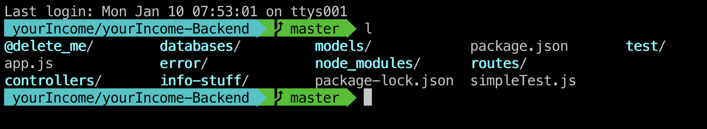
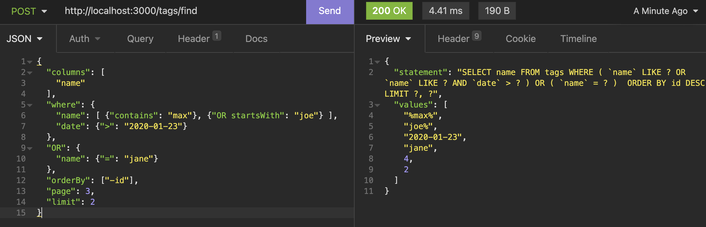

# 100 Days Of Code - Log

### Day 12: Jan 12, 2022

##### Today's Progress: 

- codepedia ready for deploy
- created a demo app for germanpsycho.de - ready for deploy
- created a demo desktop-app for germanpsycho.de
- leared more about docker

##### Learning/Tutorials:

- 1 h personal mentoring

##### Thoughts:


------

### Day 11: Jan 12, 2022

##### Today's Progress: 

- added again a lot of new content and images to codepedia - will be ready to deploy tomorrow
- more finetuning on the backend for my bookkeeping/tax app 

##### Learning/Tutorials:

- 1 chapter JS 

##### Thoughts:

i can't understand why balsamiq has no lines… but otherwise it is great

------

### Day 10: Jan 11, 2022

##### Today's Progress: 

- finished the ZTM "robofriends"- react app
- added a lot of new content and images to codepedia
- scheduled a call with a recruiter for next week 

##### Learning/Tutorials:

- finished react-basics from ZeroToMastery

##### Thoughts:

still excited about react.  balsamic wireframes is great, i will buy it!

------

### Day 9: Jan 10, 2022

##### Today's Progress: 

- updated clean code, backend-basics & terminal in my [codepedia](https://codepedia.functionfactory.de/cleancode/)
- found balsamic wireframes -  wireframing-tool. Looks cool so far

##### Learning/Tutorials:

- finished naming chapter in udemy clean-code
- 4 chapters in learing to learn
- more react-basics

##### Thoughts:

writing myCodepedia takes a lot of time but it is totally worth it. it covers a lot of principles from the learning to learn-course:

- repetition
- taking notes and writing my own summary gets the information from the shortterm memory to the longterm memory
- it also applies the feynman principle ("if you want to undestand something really well, you need to be able to teach it"):  my goal is to structure the information as if i would have to teach it

------

### Day 8: Jan 9, 2022

##### Today's Progress: 

- installed iTerm2, .zsh-oh-my & added aliases. 



- installed quokka vscode-extension - nice

##### Learning/Tutorials:

- quokka-tutorial

------

### Day 7: Jan 8, 2022

##### Today's Progress: 

- finetuned the backend for my bookkeeping/tax app 
- Now i can send almost any search-query to MySQL by sending a JSON to my server. Without using an external ORM-Package:



##### Learning/Tutorials:

- learn2learn 4 episodes

##### Thoughts:

weekend - i'll take it easy…

------

### Day 6: Jan 7, 2022

##### Today's Progress: 

- finetuned the backend for my bookkeeping/tax app 

- figured out how to display the git-branchname in the terminal

  

##### Learning/Tutorials:

- insomnia - handle collections & create api-documentation
- react native-basics
- lear2learn 2 episodes

##### Thoughts:

excited about React native. I don't have to learn a new language and learning React also expands my capabilities as a web developer👍

I think i like React. It feels more like writing JS then Vue

------

### Day 5: Jan 6, 2022

##### Today's Progress: 

- worked more on the backend for my bookkeeping/tax app 

  - universal findMany()-function working - my own little ORM

    


##### Learning/Tutorials:

- learning to learn

- more React basics

- more Flutter Basics

- more JS behind the scenes: hoisting, use strict

- more clean code

  

##### Thoughts:

i wonder if i should learn react native instead of flutter??

------

### Day 4: Jan 5, 2022

##### Today's Progress: 

- worked on the backend for my bookkeeping/tax app 
  - started working on a universal findMany()-function
  - applied CleanCode-Naming-Principles 


##### Learning/Tutorials:

- learning to learn: finished chapter3
- clean-code: naming
- finisehd vue-mastery: touring vue-router
- junior to senior:
  - first react component
  - tachyons
  - more dart-basics

##### Thoughts:

I have to stop working on solutions in the evening  - i couldn't sleep...

------

### Day 3: Jan 4, 2022

##### Today's Progress: 

- improved i18n and the project-structure and added more content to my music-homepage 

##### Learning/Tutorials:

- learning to learn: finished chapter2
- Junior to senior: some react-basics
- Flutter Basics: https://www.udemy.com/course/dart-flutter-leicht-gemacht/
- More Javascript details:https://www.udemy.com/course/javascript-the-complete-guide-2020-beginner-advanced/
  - learned about labled statements
  - better understanding of errors
- almost finished vuemastery - vue router


##### Thoughts:

man, i really enjoy coding :-))

------

### Day 2: Jan 3, 2022

##### Today's Progress: 

- added content to my music-homepage 
- added content to my coding-reference https://codepedia.functionfactory.de/

##### Learning/Tutorials:

- learning to learn https://www.udemy.com/course/learning-to-learn-efficient-learning-zero-to-mastery/

- clean code https://www.udemy.com/course/writing-clean-code/

- vue mastery 1 chapter - touring vue router

- junior to senior: finished section 2 https://www.udemy.com/course/the-complete-junior-to-senior-web-developer-roadmap/

- JS learned about the double &&-operator

  ```js
  const shoppingCart = isLoggedIn && ['Books']
  ```

##### Thoughts:

I want to make sure that i make progress in my projects every day.

##### Link to work:

https://github.com/shaefelinger/100-days-of-code

### 

### Day 1: Jan 2, 2022

##### Today's Progress: 

worked on my portfolio-projects

- travel-blog-project "around the world"

##### Thoughts:

i want to focus more on finishing my projects

##### Link to work:

https://aroundtheworld-blog.netlify.app/

https://functionfactory.de/projects

https://github.com/shaefelinger/HCS-Project2-TravelBlogVue

------

### 
